# ACE-Step 1.5 LoRA 训练教程

## 硬件需求

| 显存 | 说明 |
|------|------|
| 16 GB（最低） | 通常可用，但处理较长歌曲时可能出现显存不足 |
| 20 GB 及以上（推荐） | 可处理全曲长度，训练时显存占用通常维持在 17 GB 左右 |

> **提示：** 在训练开始之前的预处理阶段，需要多次重启 Gradio 以释放显存，具体时机会在后续步骤中说明。

## 免责声明

本教程使用 **Nayutan星人 (NayutalieN)** 的专辑 *ナユタン星からの物体Y*（共 13 首歌曲）作为演示，训练了 500 个 epoch（batch size 为 1）。**本教程仅用于理解 LoRA 微调技术的教育目的，请使用您的原创作品训练 LoRA。**

作为开发者，我本人非常喜欢 Nayutan星人 的作品，因此选用了其中一张专辑作为示例。如果您是权利持有者并认为本教程侵犯了您的合法权益，请立即联系我们，我们将在收到有效通知后移除相关内容。

技术应当被合理合法地使用，请尊重艺术家的创作，不要做出**损害或伤害**原创艺术家的声誉、权利或利益的行为。

---

## 数据准备

> **提示：** 对于程序脚本操作部分，如果您不熟悉编程，可以将本文档交给 Claude Code / Codex CLI / Cursor / Copilot 等 AI 编程工具，让它来帮助您完成。

### 概述

每首歌的训练数据包含以下内容：

1. **音频文件** — 支持 `.mp3`、`.wav`、`.flac`、`.ogg`、`.opus` 格式
2. **歌词** — 与音频同名的 `.lyrics.txt` 文件（也兼容 `.txt`）
3. **标注数据** — 包含 `caption`、`bpm`、`keyscale`、`timesignature`、`language` 等元信息

### 标注数据格式

如果您已拥有完整的标注数据，可以构造 JSON 文件，与音频、歌词放置在同一目录。文件结构如下：

```
dataset/
├── song1.mp3               # 音频
├── song1.lyrics.txt        # 歌词
├── song1.json              # 标注（可选）
├── song1.caption.txt       # caption（可选，也可写在 json 中）
├── song2.mp3
├── song2.lyrics.txt
├── song2.json
└── ...
```

JSON 文件结构（所有字段均为可选）：

```json
{
    "caption": "A high-energy J-pop track with synthesizer leads and fast tempo",
    "bpm": 190,
    "keyscale": "D major",
    "timesignature": "4",
    "language": "ja"
}
```

如果没有标注数据，可以通过后续章节介绍的方案获取。

---

### 歌词

将歌词保存为与音频同名的 `.lyrics.txt` 文件，放置在相同目录下。请确保歌词内容的准确性。

扫描时的歌词文件查找优先级：

1. `{文件名}.lyrics.txt`（推荐）
2. `{文件名}.txt`（向后兼容）

#### 歌词转录

如果您没有现成的歌词文本，可以通过以下工具转录获取：

| 工具 | 结构化标签 | 准确性 | 使用难度 | 部署方式 |
|------|-----------|--------|---------|---------|
| [acestep-transcriber](https://huggingface.co/ACE-Step/acestep-transcriber) | 无 | 可能有错别字 | 较高（需部署模型） | 自部署 |
| [Gemini](https://aistudio.google.com/) | 有 | 可能有错别字 | 低 | 付费 API |
| [Whisper](https://github.com/openai/whisper) | 无 | 可能有错别字 | 中等 | 自部署 / 付费 API |
| [ElevenLabs](https://elevenlabs.io/app/developers) | 无 | 可能有错别字 | 中等 | 付费 API（有免费额度） |

本项目在 `scripts/lora_data_prepare/` 下提供了对应的转录脚本：

- `whisper_transcription.py` — 调用 OpenAI Whisper API 转录
- `elevenlabs_transcription.py` — 调用 ElevenLabs Scribe API 转录

两个脚本均支持 `process_folder()` 方法批量处理整个文件夹。

#### 检查与清洗（必须）

模型转录出来的歌词可能包含错别字，**必须人工检查并修正**。

如果您使用的是 LRC 格式的歌词，需要移除其中的时间戳。以下是一个简单的清洗示例：

```python
import re

def clean_lrc_content(lines):
    """清洗 LRC 文件内容，移除时间戳"""
    result = []
    for line in lines:
        line = line.strip()
        if not line:
            continue
        # 移除时间戳 [mm:ss.x] [mm:ss.xx] [mm:ss.xxx]
        cleaned = re.sub(r"\[\d{2}:\d{2}\.\d{1,3}\]", "", line)
        result.append(cleaned)

    # 移除末尾空行
    while result and not result[-1]:
        result.pop()

    return result
```

#### 结构化标签（非必须）

如果歌词包含结构化标签（如 `[Verse]`、`[Chorus]` 等），能够帮助模型更好地学习歌曲结构。没有结构化标签也可以正常训练。

> **提示：** 可以使用 [Gemini](https://aistudio.google.com/) 为已有歌词添加结构化标签。

示例：

```
[Intro]
La la la...

[Verse 1]
Walking down the empty street
Echoes dancing at my feet

[Chorus]
We are the stars tonight
Shining through the endless sky

[Bridge]
Close your eyes and feel the sound
```

---

### 自动标注

#### 1. 获取 BPM 和 Key

使用 [Key-BPM-Finder](https://vocalremover.org/key-bpm-finder) 在线获取 BPM 和调式标注：

1. 打开网页后点击 **Browse my files**，选择待处理的音频文件（一次处理过多可能会卡住，建议分批处理后合并 CSV）。处理在本地完成，不会上传至服务器。
   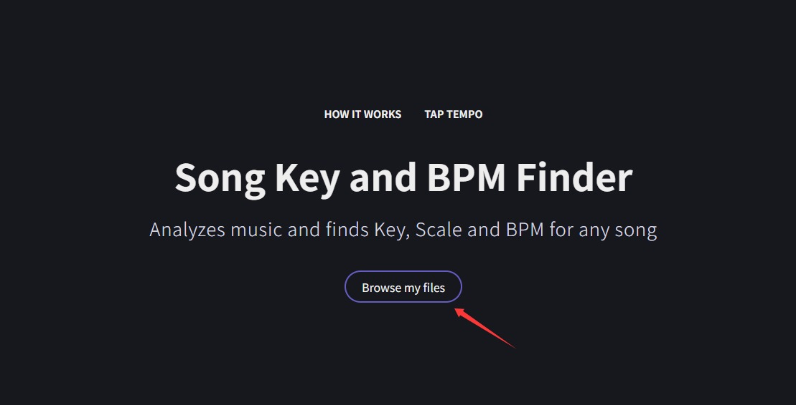

2. 处理完成后，点击 **Export CSV** 下载 CSV 文件。
   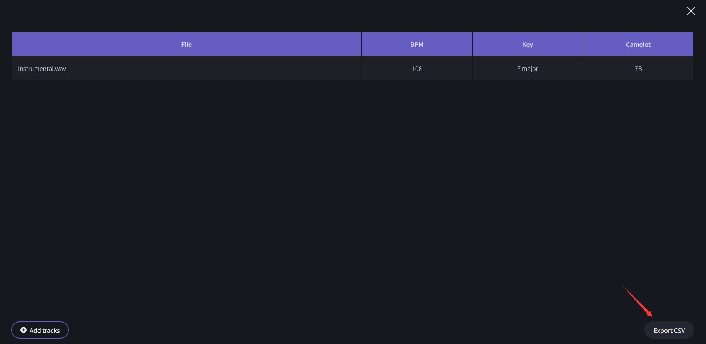

3. CSV 文件内容示例：

   ```csv
   File,Artist,Title,BPM,Key,Camelot
   song1.wav,,,190,D major,10B
   song2.wav,,,128,A minor,8A
   ```

4. 将 CSV 文件放置到数据集文件夹中。如需附加 caption 数据，可在 `Camelot` 列后新增一列。

#### 2. 获取 Caption

可通过以下方式获取歌曲的 caption 描述：

- **使用 acestep-5Hz-lm**（0.6B / 1.7B / 4B）— 在 Gradio UI 中通过 Auto Label 功能调用（见后续操作步骤）
- **使用 Gemini API** — 参考脚本 `scripts/lora_data_prepare/gemini_caption.py`，支持 `process_folder()` 批量处理，会为每个音频生成：
  - `{文件名}.lyrics.txt` — 歌词
  - `{文件名}.caption.txt` — caption 描述

---

## 数据预处理

准备好数据后，即可使用 Gradio UI 进行数据检查与预处理。

> **重要：** 如果使用启动脚本启动，需要修改启动参数以禁用服务预初始化：
>
> - **Windows** (`start_gradio_ui.bat`)：将 `if not defined INIT_SERVICE set INIT_SERVICE=--init_service true` 修改为 `if not defined INIT_SERVICE set INIT_SERVICE=--init_service false`
> - **Linux/macOS** (`start_gradio_ui.sh`)：将 `: "${INIT_SERVICE:=--init_service true}"` 修改为 `: "${INIT_SERVICE:=--init_service false}"`

启动 Gradio UI（通过启动脚本或直接运行 `acestep/acestep_v15_pipeline.py`）。

### 步骤 1：加载模型

- **需要使用 LM 生成 caption 的情况：** 在初始化时勾选想要使用的 LM 模型（acestep-5Hz-lm-0.6B / 1.7B / 4B）。
  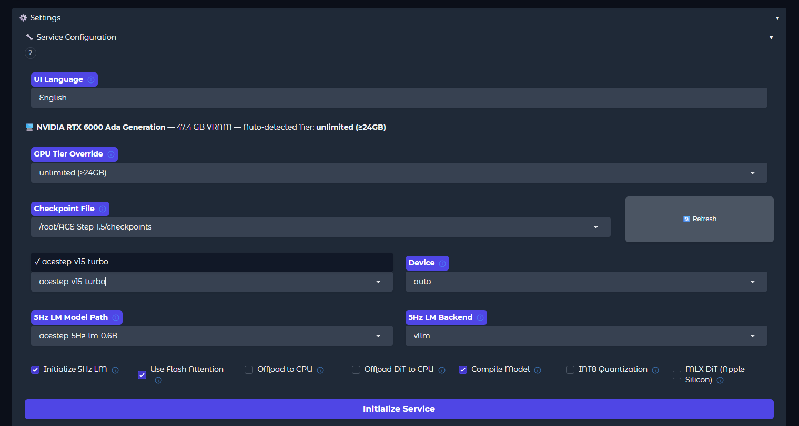

- **不需要使用 LM 的情况：** 不要勾选 LM 模型。
  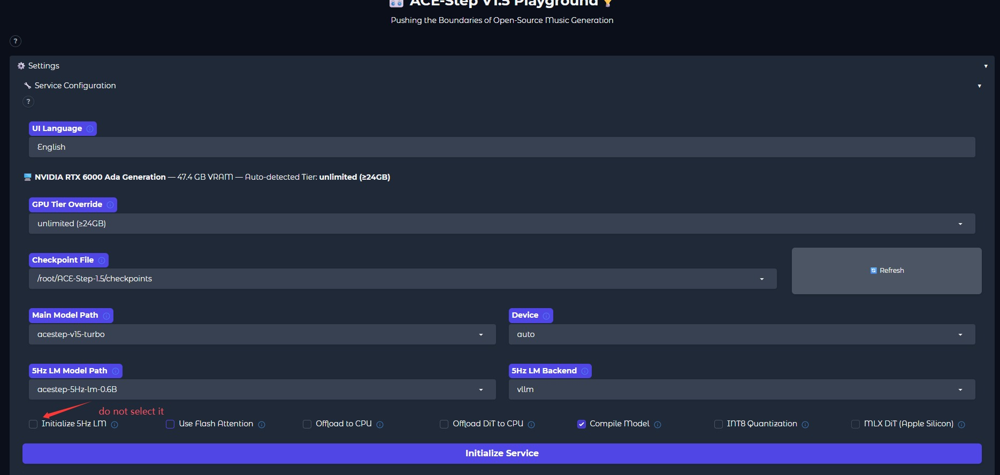

### 步骤 2：加载数据

切换到 **LoRA Training** 选项卡，输入数据集目录路径，点击 **Scan**。

扫描时会自动识别以下文件：

| 文件 | 说明 |
|------|------|
| `*.mp3` / `*.wav` / `*.flac` / ... | 音频文件 |
| `{文件名}.lyrics.txt`（或 `{文件名}.txt`） | 歌词 |
| `{文件名}.caption.txt` | Caption 描述 |
| `{文件名}.json` | 标注元数据（caption / bpm / keyscale / timesignature / language） |
| `*.csv` | 批量 BPM / Key 标注（由 Key-BPM-Finder 导出） |

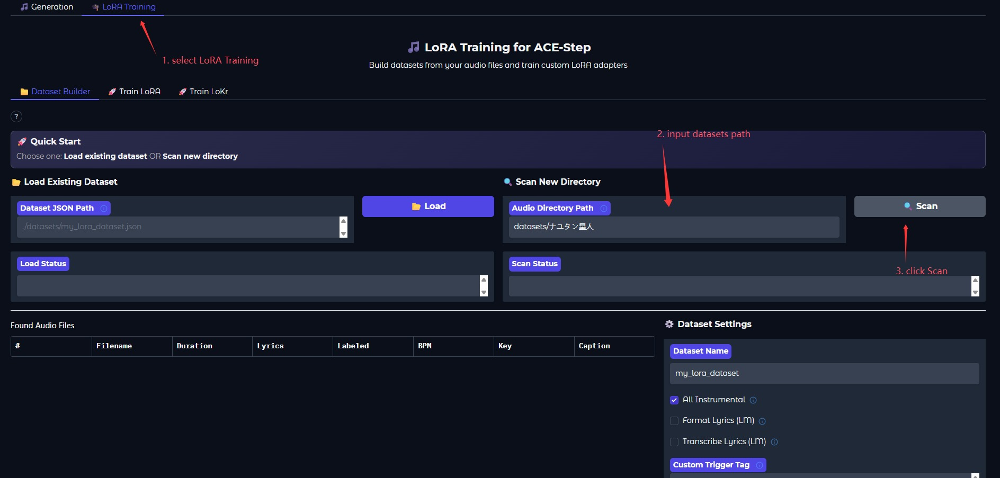

### 步骤 3：预览并调整数据集

- **Duration** — 自动从音频文件读取
- **Lyrics** — 需要存在同名 `.lyrics.txt` 文件（也兼容 `.txt`）
- **Labeled** — 如果有 caption 则显示 ✅，否则显示 ❌
- **BPM / Key / Caption** — 从 JSON 或 CSV 文件中加载
- 如果数据集并非全部为纯音乐（Instrumental），请取消勾选 **All Instrumental**
- **Format Lyrics** 与 **Transcribe Lyrics** 功能当前暂时禁用（未接入 [acestep-transcriber](https://huggingface.co/ACE-Step/acestep-transcriber)，直接使用 LM 容易产生幻觉）
- 输入 **Custom Trigger Tag**（当前效果尚不明显，只要不选 `Replace Caption` 即可）
- **Genre Ratio** 表示使用 genre 替代 caption 的比例。由于当前 LM 生成的 genre 描述能力远不及 caption，建议保持为 0

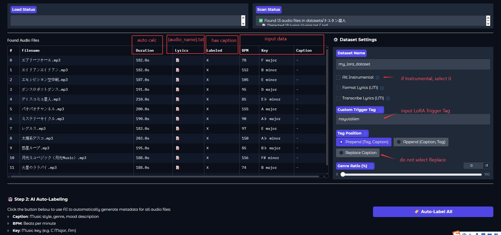

### 步骤 4：Auto Label Data

- 如果已有 caption，可跳过此步骤
- 如果数据缺少 caption，可通过 LM 推理生成
- 如果缺少 BPM / Key 等数值，请先使用 [Key-BPM-Finder](https://vocalremover.org/key-bpm-finder) 获取，直接由 LM 生成会产生幻觉

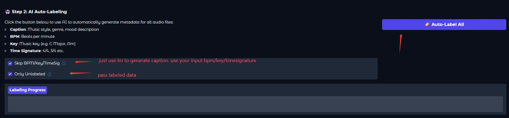

### 步骤 5：预览并编辑数据

如有需要，可以逐条检查并修改数据。**每条数据修改后请记得点击保存。**

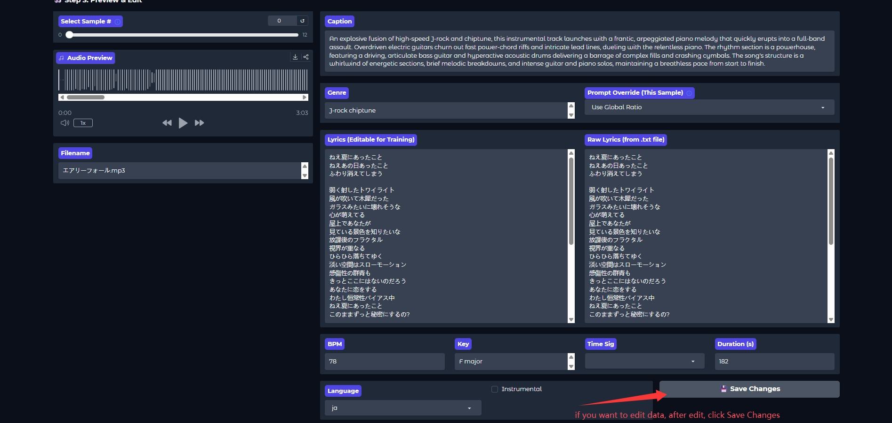

### 步骤 6：保存数据集

输入保存路径，将数据集保存为 JSON 文件。

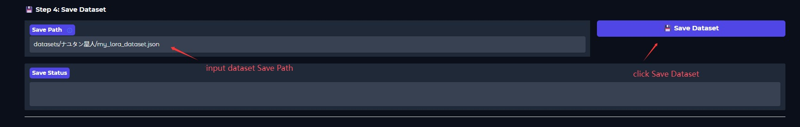

### 步骤 7：预处理生成 Tensor 文件

> **注意：** 如果此前使用了 LM 生成 caption 且显存不足，建议先重启 Gradio 释放显存，重启时**不要勾选 LM 模型**。重启后，在输入框中填入已保存的 JSON 文件路径并加载。

输入 Tensor 文件的保存路径，点击开始预处理，等待生成完成。

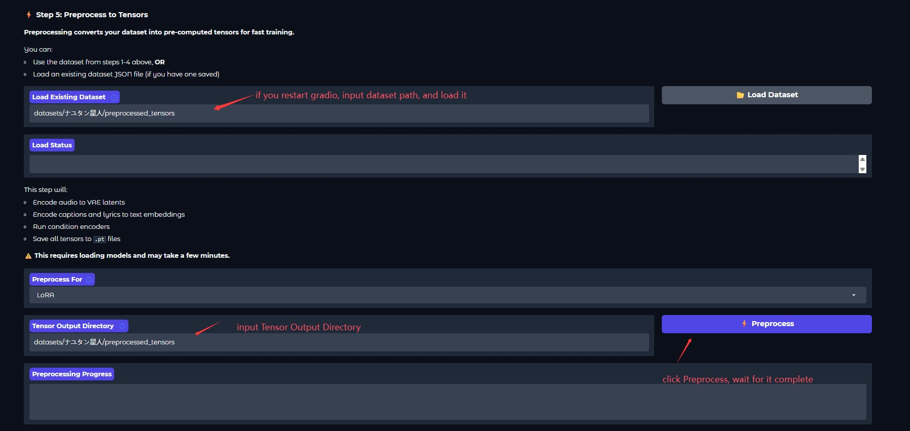

---

## 训练

> **注意：** 生成 Tensor 文件后，同样建议重启 Gradio 以释放显存。

1. 切换到 **Train LoRA** 选项卡，输入 Tensor 文件路径并加载数据集。
2. 如果您对训练参数不熟悉，通常使用默认值即可。

### 参数参考

| 参数 | 说明 | 建议值 |
|------|------|--------|
| **Max Epochs** | 根据数据集大小调整 | 约 100 首歌 → 500 epoch；10–20 首歌 → 800 epoch（仅供参考） |
| **Batch Size** | 显存充足时可适当增大 | 1（默认），显存足够的话 可尝试 2 或 4 |
| **Save Every N Epochs** | Checkpoint 保存间隔 | Max Epochs 较小时可设小一些，较大时可设大一些 |

> 以上数值仅供参考，请根据实际情况调整。

> **💡 推荐使用 LoKr：** LoKR 大幅提升了训练效率，原本需要一小时的训练现在只需 5 分钟——速度提升超过 10 倍。这对于在消费级 GPU 上训练尤为关键。您可以在 **Train LoKr** 选项卡中尝试 LoKr 训练，或使用 [Side-Step](https://github.com/koda-dernet/Side-Step) 工具包进行命令行 LoKr 训练。详见 [Training Guide](../sidestep/Training%20Guide.md)。

3. 点击 **Start Training**，等待训练完成。

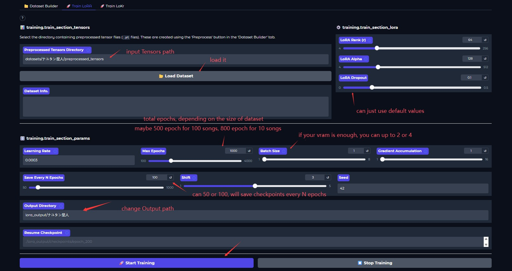

---

## 使用 LoRA

1. 训练完成后**重启 Gradio**，重新加载模型（不要勾选 LM 模型）。
2. 模型初始化完成后，加载训练好的 LoRA 权重。
   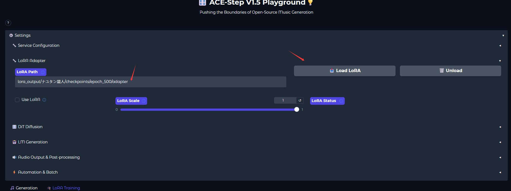
3. 开始合成音乐。

恭喜！您已完成 LoRA 训练的全部流程。

---

## 高级训练：Side-Step

如果你需要更精细地控制 LoRA 训练——包括修正的时间步采样、LoKR 适配器、命令行工作流、显存优化和梯度敏感度分析——社区开发的 **[Side-Step](https://github.com/koda-dernet/Side-Step)** 工具包提供了高级替代方案。其文档已收录在本仓库的 `docs/sidestep/` 目录下。

| 主题 | 说明 |
|------|------|
| [Getting Started](../sidestep/Getting%20Started.md) | 安装、前置条件和首次运行设置 |
| [End-to-End Tutorial](../sidestep/End-to-End%20Tutorial.md) | 从原始音频到生成的完整流程 |
| [Dataset Preparation](../sidestep/Dataset%20Preparation.md) | JSON 格式、音频要求、元数据字段、自定义标签 |
| [Training Guide](../sidestep/Training%20Guide.md) | LoRA vs LoKR、修正模式 vs 原始模式、超参数指南 |
| [Using Your Adapter](../sidestep/Using%20Your%20Adapter.md) | 输出目录结构、在 Gradio 中加载、LoKR 限制 |
| [VRAM Optimization Guide](../sidestep/VRAM%20Optimization%20Guide.md) | 显存优化策略和 GPU 分级配置 |
| [Estimation Guide](../sidestep/Estimation%20Guide.md) | 梯度敏感度分析，用于针对性训练 |
| [Shift and Timestep Sampling](../sidestep/Shift%20and%20Timestep%20Sampling.md) | 训练时间步的工作原理，Side-Step 与内置训练器的区别 |
| [Preset Management](../sidestep/Preset%20Management.md) | 内置预设、保存/加载/导入/导出 |
| [The Settings Wizard](../sidestep/The%20Settings%20Wizard.md) | 完整的向导设置参考 |
| [Model Management](../sidestep/Model%20Management.md) | 检查点结构和微调模型支持 |
| [Windows Notes](../sidestep/Windows%20Notes.md) | Windows 特定的设置和注意事项 |
